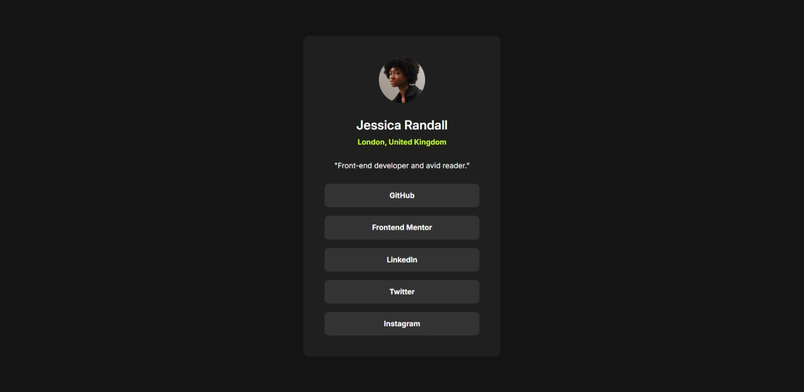

# Frontend Mentor - Social links profile solution

This is a solution to the [Social links profile challenge on Frontend Mentor](https://www.frontendmentor.io/challenges/social-links-profile-UG32l9m6dQ). Frontend Mentor challenges help you improve your coding skills by building realistic projects.

## Table of contents

- [Overview](#overview)

  - [The challenge](#the-challenge)
  - [Screenshot](#screenshot)
  - [Links](#links)

  - [Built with](#built-with)

### Screenshot

### Links

- Solution URL: [Solution Code](https://github.com/SydsBike/03-social-links-profile-main)
- Live Site URL: [Live Site](https://sydsbike.github.io/03-social-links-profile-main/)

### Built with

- Semantic HTML5 markup
- CSS custom properties
- Flexbox
- CSS Grid
- Mobile-first workflow
